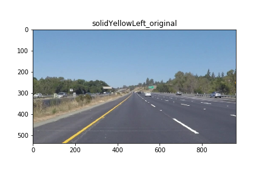
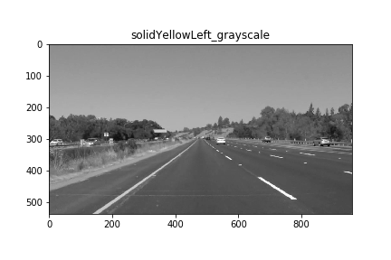
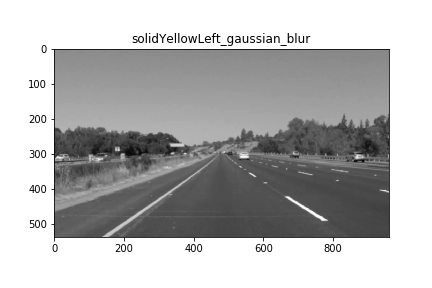
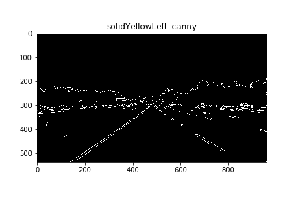
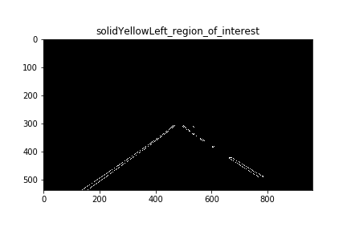
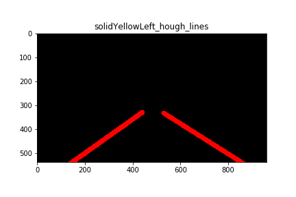
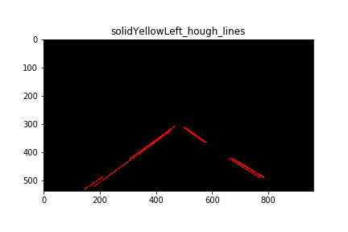
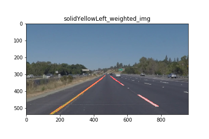

# **Finding Lane Lines on the Road**

## Writeup

**Finding Lane Lines on the Road**

The goals / steps of this project are the following:
* Make a pipeline that finds lane lines on the road
* Reflect on your work in a written report

[//]: # (Image References)

[image1]: ./examples/grayscale.jpg "Grayscale"

---

### Reflection

### Pipeline

TODO: Describe your pipeline. As part of the description, explain how you modified the draw_lines() function.

My pipeline consisted of 5 steps.
1. Given an image: 

2. I converted the image to grayscale: 

3. bla 

4. blub 

5. sdf 

6.sdf 
 oder 
7. sdf 
 oder 

Description  | not improved  | pipeline  | improved
--|---|---|--
Given an image:  |   |   |  
I converted the image to grayscale:  |   |   |  
gaussian_blur:  |   |   |  
Canny  |   |   |  
region of interest:  |   |   |  
hough_lines:  |   |   |  
weighted_img:  |   |   |  

In order to draw a single line on the left and right lanes, I modified the draw_lines() function by ...

If you'd like to include images to show how the pipeline works, here is how to include an image:

![alt text][image1]

### 2. Identify potential shortcomings with your current pipeline

One potential shortcoming would be what would happen when ...

Another shortcoming could be ...

### 3. Suggest possible improvements to your pipeline

A possible improvement would be to ...

Another potential improvement could be to ...
