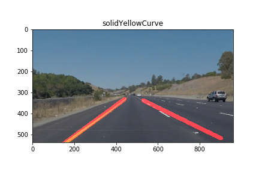

# **Finding Lane Lines on the Road**

## Writeup

**Finding Lane Lines on the Road**

The goals of this project is to make a pipeline that finds lane lines on the road.

### Reflection

### Pipeline

The pipeline performs the following steps:
1. Given an image:  
2. Convert the image to grayscale:  
3. Blur the image using a Gaussian filter:  
4. Find edges in the image using the Canny algorithm:  
5. Keep a polygonal region of the image probably containing lane lines:  
6. Find lane lines in the image using the (probabilistic) Hough transform:
   - using `draw_lines()`:  
   - using `draw_left_lane_and_right_lane()` (explained below): 
 
 7. Draw the lane lines found in the previous step onto the original image:
    - using `draw_lines()`:   
    - using `draw_left_lane_and_right_lane()`:  

In order to draw a single line on the left and right lanes, I created a modified version of the `draw_lines(image, lines, ...)` function named `draw_left_lane_and_right_lane(image, lines, ...)`:
- It first partitions the `lines` into two subsets: one for left lines and another one for right lines. A left line is defined to go from bottom left to top right having a negative slope (or infinity) and a right line goes from bottom right to top left and has a positive slope.
- Then for each of the subsets (left line subset and right line subset) I fitted a least squares linear regressor (`LinearRegression` from _sklearn_) to all the line endpoints of the subset, resulting in a line best approximating all the line endpoints of the subset. This best approximating line is defined to be the lane line which is then drawn onto the `image`.

### 2. Identify potential shortcomings with your current pipeline

One potential shortcoming would be what would happen when ...

Another shortcoming could be ...

- **imprecise**: lane lines are not precisely recognized, which can be seen in the image below where the right red line is not drawn over the white lane line near the bottom of the image: 

### 3. Suggest possible improvements to your pipeline

A possible improvement would be to ...

Another potential improvement could be to ...
