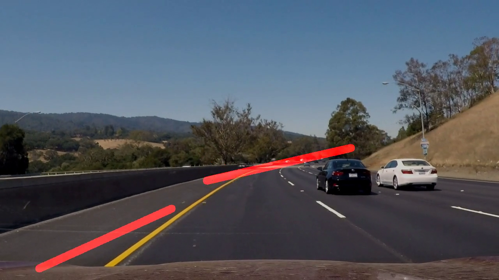

# **Finding Lane Lines on the Road**

## Writeup

**Finding Lane Lines on the Road**

The goals of this project is to make a pipeline that finds lane lines on the road.

### Reflection

### Pipeline

The pipeline performs the following steps:
1. Given an image:  
2. Convert the image to grayscale:  
3. Blur the image using a Gaussian filter:  
4. Find edges in the image using the Canny algorithm:  
5. Keep a polygonal region of the image probably containing lane lines:  
6. Find lane lines in the image using the (probabilistic) Hough transform:
   - using `draw_lines()`:  
   - using `draw_left_lane_and_right_lane()` (explained below): 
 
 7. Draw the lane lines found in the previous step onto the original image:
    - using `draw_lines()`:   
    - using `draw_left_lane_and_right_lane()`:  

In order to draw a single line on the left and right lanes, I created a modified version of the `draw_lines(image, lines, ...)` function named `draw_left_lane_and_right_lane(image, lines, ...)`:
- It first partitions the `lines` into two subsets: one for left lines and another one for right lines. A left line is defined to go from bottom left to top right having a negative slope (or infinity) and a right line goes from bottom right to top left and has a positive slope.
- Then for each of the subsets (left line subset and right line subset) I fitted a least squares linear regressor (`LinearRegression` from _sklearn_) to all the line endpoints of the subset, resulting in a line best approximating all the line endpoints of the subset. This best approximating line is defined to be the lane line which is then drawn onto the `image`.

### 2. potential shortcomings with the current pipeline

#### Imprecise
Lane lines are not precisely recognized, which can be seen in the image below where the right red line is not drawn over the white lane line near the bottom of the image:  

#### Sometimes totally wrong
The pipeline is totally wrong in finding lane lines applied to the challenge: 
 

#### Predefined region of interest
Step five of the pipeline uses a predefined region of interest probably containing lane lines which heavily relies on the correct placement of the camera within the car. When the camera position within the car is changed then the current pipeline most likely won't work any more.

#### Lightning conditions
The pipeline was tested with images taken in daylight. Does the pipeline still work when applied to images taken at night with car headlights switched on?

####
### 3. Suggest possible improvements to the pipeline

#### Automatically find good parameters for the pipeline
In order to automatically find good parameters for the pipeline, the following steps could be performed:
- Mark lane lines in some images and videos by hand.
- Then define a similarity measure of lane lines, e.g. using the inverse of the mean distance of two lines.
- Programmatically test some combinations of different parameter values of the pipeline (low and high Canny thresholds, Hough lines parameters, kernel sizes, ...). Then take the best found parameter combination, i.e. the one resulting in the highest value for the similarity measure.

#### Use different types of edge detection algorithms
Maybe use not only the Canny edge detection algorithm, but also Sobel, Scharr and Laplacian.

#### Use deep learning
In order to find lane lines within images one could use a deep neural network. In my current understanding of this topic, a convolutional neural network can come up with something like a Canny edge detection algorithm and a Gaussian filter on it's own in it's convolutional layers.
